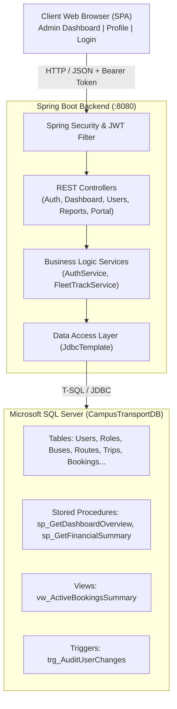

# Campus Travelling System (BusTrans Pro)
### Administrative Dashboard & Financial Reporting Module

[](https://www.oracle.com/java/)
[](https://spring.io/projects/spring-boot)
[](https://www.microsoft.com/en-us/sql-server)
[](https://jwt.io/)
[](https://github.com/tenukap/University-Transport-System/tree/Admin-page)

---

## 📌 Project Overview

The **Campus Travelling System (BusTrans Pro)** is a centralized transport management web platform engineered for university campus transit logistics. This module specifically implements the **Administrative Dashboard & Financial Reporting** subsystem, delivering real-time transit fleet monitoring, role-based user management, financial revenue analytics, announcement publishing, and passenger feedback moderation.

The system is built on an enterprise multi-tier architecture featuring a **Spring Boot 3 RESTful API**, an integrated responsive **Single-Page Application (SPA)** frontend, and a high-performance **Microsoft SQL Server** relational database with stored procedures, views, and audit triggers.

---

## 👨‍💻 Contributor Details

- **Student Name:** Doane A.J.J
- **Registration No:** IT25103292
- **Module Focus:** Section 6.6 — Administrative Dashboard & Financial Reporting
- **Project Repository:** [University-Transport-System](https://github.com/tenukap/University-Transport-System)
- **Target Branch:** `Admin-page`

---

## 🏗️ System Architecture



---

## ✨ Key Features

### 1. Administrative Overview & Fleet KPIs
- Real-time fleet metrics (Active Buses, On-Trip Vehicles, Scheduled Trips, Maintenance Status).
- Total passenger counts, active bookings, and today's total revenue calculation.
- Live system status checks and alerts banner.

### 2. User & Access Management
- Role-Based Access Control (**RBAC**) supporting `Admin`, `FinanceOfficer`, `Student`, and `Driver`.
- User lifecycle management (Create, Update, Delete with transactional cascading).
- Student group categorization (`IT Batch 2026`, `Engineering Y2`, etc.) and account status control (`Active`, `Suspended`, `Deactivated`).

### 3. Financial Reporting & Analytics
- Stored procedure-powered revenue aggregation (`sp_GetFinancialSummary`).
- Breakdown by ticket sales, transit passes, chartered trips, and net profit margins.
- One-click CSV export (`/api/reports/financial.csv`) for accounting and audit compliance.

### 4. Announcements & Feedback Moderation
- Broadcast campus-wide transit announcements with audience targeting (`All`, `Students`, `Staff`, `Drivers`).
- Moderation feed for passenger ratings, complaints, and service reviews.

### 5. Security & Session Management
- Stateless authentication using **JSON Web Tokens (JWT)** with BCrypt password hashing.
- Role-guarded API endpoints preventing unauthorized student/driver access to admin data.
- User profile interface with personalized detail updates.

---

## 🗄️ Database Architecture & SQL Server Setup

The database layer runs on **Microsoft SQL Server** with the database named `CampusTransportDB`.

### Included Database Scripts
1. **`SQLQuery6.sql`**: Complete database schema creation script.
   - **Tables:** `Roles`, `StudentGroups`, `Users`, `Buses`, `Routes`, `Trips`, `Bookings`, `Announcements`, `Feedback`, `SavedReports`, `AdminAuditLogs`.
   - **Stored Procedures:**
     - `sp_GetDashboardOverview` — Gathers total users, active buses, total bookings, today's revenue in one round-trip.
     - `sp_GetFinancialSummary` — Aggregates revenue, operational expenses, and net profit over specified date intervals.
   - **Views:** `vw_ActiveBookingsSummary` — Pre-joined view for rapid booking inquiries.
   - **Triggers:** `trg_AuditUserChanges` — Automatically records user updates/deletions to `AdminAuditLogs`.
   - **Seed Data:** Populates sample buses, routes, trips, roles, and initial users.

2. **`fix_password_hashes.sql`**: Sets real BCrypt password hashes for the default test accounts (replacing placeholder hashes).

---

### Step-by-Step Database Installation

#### 1. Open SQL Server Management Studio (SSMS) or Azure Data Studio
Connect to your local SQL Server instance (default port `1433`).

#### 2. Create the Database
```sql
CREATE DATABASE CampusTransportDB;
GO
```

#### 3. Execute `SQLQuery6.sql`
Open `SQLQuery6.sql` in SSMS and execute it against `CampusTransportDB`. This builds all tables, stored procedures, views, triggers, and sample data.

#### 4. Execute `fix_password_hashes.sql`
Open `fix_password_hashes.sql` in SSMS and execute it. This updates all test users with production-valid BCrypt hashes so logins succeed.

#### 5. Verify SQL Server User Access
Ensure SQL Server Authentication is enabled and user `fleettrack` exists, or use your SQL Server credentials:
```sql
-- Optional: Create fleettrack SQL user if not already created
CREATE LOGIN fleettrack WITH PASSWORD = 'FleetTrack@2026!';
USE CampusTransportDB;
CREATE USER fleettrack FOR LOGIN fleettrack;
ALTER ROLE db_owner ADD MEMBER fleettrack;
GO
```

---

## 🔐 Default Test Credentials

All demo accounts have been configured with BCrypt password hashes via `fix_password_hashes.sql`:

| Role | Email | Password | Access Rights |
| :--- | :--- | :--- | :--- |
| **System Admin** | `admin@campus.edu` | `Admin@123` | Full access to Admin Dashboard, Users, Reports, Trips, Fleet |
| **Finance Officer** | `finance@campus.edu` | `Finance@123` | Access to Financial Reports, Invoicing, Bookings, Dashboard |
| **Student** | `alex@student.campus.edu` | `Student@123` | Profile portal, personal booking views |
| **Suspended User** | `jane@student.campus.edu` | `Student@123` | *Rejected* — account status is `Suspended` |

---

## ⚙️ Configuration & Environment Variables

Database and security settings are configured in `backend/src/main/resources/application.properties`. You can customize them directly or set environment variables:

| Setting / Property | Environment Variable | Default Value | Description |
| :--- | :--- | :--- | :--- |
| `spring.datasource.url` | `DB_URL` | `jdbc:sqlserver://localhost:1433;databaseName=CampusTransportDB;encrypt=true;trustServerCertificate=true` | JDBC connection string |
| `spring.datasource.username` | `DB_USERNAME` | `fleettrack` | Database login username |
| `spring.datasource.password` | `DB_PASSWORD` | `FleetTrack@2026!` | Database login password |
| `app.jwt.secret` | `JWT_SECRET` | `change-this-development-secret-to-a-long-random-value` | Secret key for JWT signing |
| `app.jwt.expiration-hours` | `JWT_EXPIRATION_HOURS` | `8` | JWT token validity in hours |
| `server.port` | `PORT` | `8080` | Spring Boot server port |

---

## 🚀 How to Run the Application

### Prerequisites
- **Java Development Kit (JDK):** Version 17
- **Database:** Microsoft SQL Server (2019/2022 or Express)
- **IDE (Recommended):** IntelliJ IDEA (Community or Ultimate)

---

### Option 1: Run with IntelliJ IDEA (Recommended)

1. Open IntelliJ IDEA.
2. Select **File → Open...** and choose the root project folder: `campus travelling system` (the directory with the root `pom.xml`).
3. Click **Trust Project**.
4. When prompted by IntelliJ, click **Load Maven Project**. Wait for indexing and dependencies to download.
5. In the top-right run configurations dropdown, select **Campus Travelling System** (or **backend: spring-boot run**).
6. Click the green **Run** (▶) button.
7. Open your web browser and navigate to:
   - **Login Page:** [http://localhost:8080/login.html](http://localhost:8080/login.html)
   - **Admin Dashboard:** [http://localhost:8080/code.html](http://localhost:8080/code.html)
   - **Profile Interface:** [http://localhost:8080/profile.html](http://localhost:8080/profile.html)

---

### Option 2: Run from the Command Line / Terminal

Open PowerShell or Command Prompt in the project folder:

```powershell
# 1. Navigate to backend directory
cd backend

# 2. Run with Maven
mvn spring-boot:run
```

If you need to override database credentials in PowerShell:
```powershell
$env:DB_USERNAME = "sa"
$env:DB_PASSWORD = "YourStrongPassword!"
mvn spring-boot:run
```

---

## 📡 REST API Documentation

### Authentication & Portal
| Method | Endpoint | Access | Description |
| :--- | :--- | :--- | :--- |
| `POST` | `/api/auth/login` | Public | Authenticates Admin / Finance Officer; returns JWT token |
| `POST` | `/api/portal/login` | Public | Student/Driver portal authentication |
| `GET` | `/api/portal/me` | Authenticated | Fetches authenticated user's session profile |

### Dashboard & Analytics
| Method | Endpoint | Access | Description |
| :--- | :--- | :--- | :--- |
| `GET` | `/api/dashboard` | `ADMIN`, `FINANCE_OFFICER` | Returns KPI cards, active fleet counts, recent activity |
| `GET` | `/api/reports/financial` | `ADMIN`, `FINANCE_OFFICER` | Fetches JSON revenue breakdown, income vs expenses |
| `GET` | `/api/reports/financial.csv` | `ADMIN`, `FINANCE_OFFICER` | Generates and downloads financial audit report in CSV |

### User Management
| Method | Endpoint | Access | Description |
| :--- | :--- | :--- | :--- |
| `GET` | `/api/users` | `ADMIN`, `FINANCE_OFFICER` | Lists all users with role and group metadata |
| `POST` | `/api/users` | `ADMIN` | Registers a new user with BCrypt password hashing |
| `GET` | `/api/users/{id}` | `ADMIN`, `FINANCE_OFFICER` | Retrieves single user details |
| `PUT` | `/api/users/{id}` | `ADMIN` | Updates full name, role, status, or phone |
| `DELETE` | `/api/users/{id}` | `ADMIN` | Cascades and removes user record and audit trail |

### Bookings, Announcements & Feedback
| Method | Endpoint | Access | Description |
| :--- | :--- | :--- | :--- |
| `GET` | `/api/bookings` | `ADMIN`, `FINANCE_OFFICER` | Lists recent passenger bookings |
| `POST` | `/api/bookings` | `ADMIN`, `FINANCE_OFFICER` | Creates a new trip booking |
| `DELETE` | `/api/bookings/{id}` | `ADMIN` | Cancels and removes booking |
| `GET` | `/api/announcements` | `ADMIN`, `FINANCE_OFFICER` | Lists current broadcast announcements |
| `POST` | `/api/announcements` | `ADMIN` | Publishes a new announcement |
| `DELETE` | `/api/announcements/{id}` | `ADMIN` | Deletes an announcement |
| `GET` | `/api/feedback` | `ADMIN`, `FINANCE_OFFICER` | Fetches all passenger reviews and ratings |

### Profile
| Method | Endpoint | Access | Description |
| :--- | :--- | :--- | :--- |
| `GET` | `/api/profile/me` | All Roles | Fetches current user profile |
| `PUT` | `/api/profile/me` | All Roles | Updates personal profile information |

---

## 📁 Project Directory Structure

```text
campus travelling system/
├── .gitignore                                # Git ignore rules (build artifacts, IDE user files)
├── .run/                                     # IntelliJ shared run configurations
│   ├── Campus Travelling System.run.xml
│   └── backend spring-boot run.run.xml
├── SQLQuery6.sql                             # Master SQL Server schema, procs, triggers & data
├── fix_password_hashes.sql                   # BCrypt password hash fixer for test users
├── pom.xml                                   # Root Maven parent POM
├── README.md                                 # Complete project documentation
│
├── backend/                                  # Spring Boot Application Module
│   ├── pom.xml                               # Backend Maven dependencies (Spring Boot 3.3.5)
│   ├── README.md                             # Module-specific instructions
│   └── src/
│       ├── main/
│       │   ├── java/com/bustrans/fleettrack/
│       │   │   ├── FleetTrackApplication.java # Main application entry point
│       │   │   ├── config/                   # SecurityConfig & WebConfig (CORS)
│       │   │   ├── controller/               # Auth, Dashboard, User, Portal, Profile controllers
│       │   │   ├── dto/                      # Data Transfer Objects
│       │   │   ├── exception/                # Global API exception handling
│       │   │   ├── model/                    # Domain models & entities
│       │   │   ├── repository/               # UserRepository (Spring JdbcTemplate)
│       │   │   ├── security/                 # JwtAuthenticationFilter & JwtService
│       │   │   └── service/                  # AuthService & FleetTrackService
│       │   └── resources/
│       │       ├── application.properties    # Server & Database connection settings
│       │       └── static/                   # Production UI (HTML/CSS/JS/Assets)
│       │           ├── code.html             # Admin Dashboard UI
│       │           ├── login.html            # Sign-in & Authentication Page
│       │           ├── profile.html          # User Profile Interface
│       │           └── screen.png            # Interface screenshots
│
└── front end/                                # UI Prototypes & Design Specifications
    ├── DESIGN.md                             # UI/UX design specifications & palette
    ├── README.md                             # Frontend guidelines
    ├── admin dasboard/                       # Admin Dashboard design & mockups
    ├── front end of sign in/                 # Sign-in screen designs
    └── stitch_transport_profile_interface/  # Profile interface designs
```

---

## 🚀 Git Workflow: How to Push to Your Branch (`Admin-page`)

To push your work to your assigned branch on GitHub:

```powershell
# 1. Switch or create your local Admin-page branch tracking origin/Admin-page
git checkout -B Admin-page origin/Admin-page

# 2. Stage all project files (backend, frontend, SQL scripts, configs, documentation)
git add .

# 3. Commit your changes with a descriptive message
git commit -m "feat(admin): complete admin dashboard, SQL Server integration, REST API, and documentation"

# 4. Push to your branch on GitHub
git push origin Admin-page
```

### Creating a Pull Request
1. Open the repository on GitHub: [tenukap/University-Transport-System](https://github.com/tenukap/University-Transport-System)
2. Click on the **Pull requests** tab.
3. Click **New pull request**.
4. Set **base: `main`** and **compare: `Admin-page`**.
5. Title: `feat: Administrative Dashboard & Financial Reporting Module (IT25103292)`
6. Click **Create pull request**.
